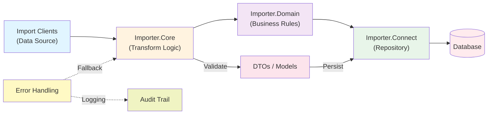
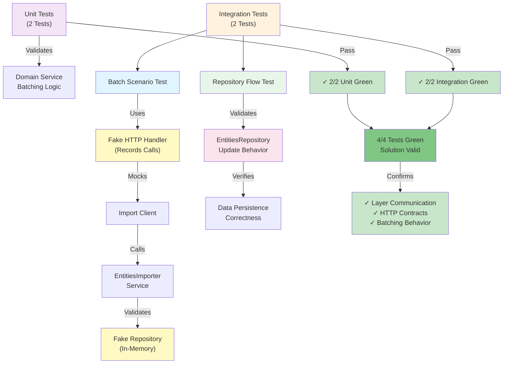

# ImportEntities — Presentation Form Content

Use the values below directly in your project form.

## Field Entries

- **Project name\***: ImportEntities — Multi-Layer Entity Import Pipeline (ASP.NET Core/.NET 8)
- **Description**: A production-ready, multi-layer entity import platform that orchestrates the ingestion, transformation, and persistence of diverse entity types (users, movies, etc.) from multiple data sources into a centralized database. The architecture is organized into four core layers: **Importer.Clients** (source-specific import clients and HTTP integrations), **Importer.Core** (reusable transformation and validation logic), **Importer.Domain** (domain-specific business logic and entity-specific services), and **Importer.Connect** (database connectivity and repository patterns). The project includes comprehensive unit and integration test coverage to validate cross-layer communication, HTTP contract correctness, batching behavior, and data persistence. This foundation supports reliable, maintainable, and scalable entity import workflows across the application ecosystem.

## Architecture Diagrams

### 1. Import Pipeline Architecture

### 2. Integration Testing Strategy

- **Skills (Top 5)**:
  1. .NET Layered Architecture & Design Patterns
  2. Data Import Pipeline Engineering
  3. xUnit Unit & Integration Testing
  4. Repository Pattern & Data Access Layer Design
  5. HTTP Client Integration & Contract Validation
- **Media**:
  - Multi-layer architecture diagram with component interactions
  - Layer responsibilities and communication flow visualization
  - Integration test strategy and coverage documentation
  - Project structure and setup instructions
- **I am currently working on this project**: Yes (active development and expansion)
- **Start date (Month/Year)**: April 2026
- **End date (Month/Year)**: Ongoing
- **Contributors**:
  - Development Team — Architecture, Core Implementation
  - Code Reviewers — Quality assurance and design validation
- **Associated with**: Internal Engineering Portfolio — Data Integration & ETL Pipelines

## Optional One-Line Executive Summary

A scalable, multi-layer ASP.NET Core platform for reliable entity import orchestration with production-ready testing and clean layered architecture.
