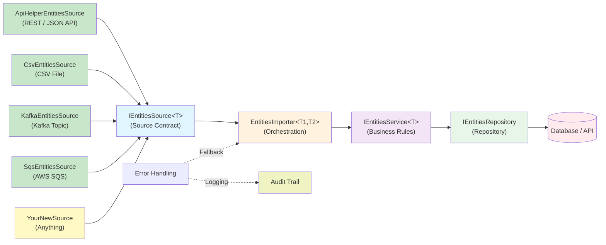
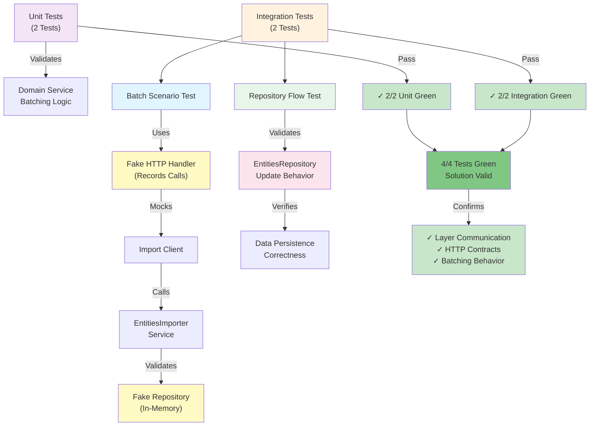

# ImportEntities — Project Presentation

## Project Name

ImportEntities — Reusable Multi-Source Entity Import Platform

## Description

ImportEntities is a .NET 8 import platform designed to ingest entities from multiple source types through a single reusable pipeline. It combines source adapters, generic orchestration, business-rule processing, and repository persistence behind clean interfaces so new import scenarios can be added without rewriting the entire flow.

The implementation focuses on extensibility and operational discipline: source-agnostic ingestion, layered architecture, config-driven integrations, structured logging, archive support for replay/debugging, and automated verification through unit and integration tests.

## Skills Demonstrated

- Layered architecture with clear boundaries between clients, domain services, repositories, and shared primitives
- Generic pipeline design using reusable orchestration and source abstractions
- Dependency injection and composition for client-specific import flows
- Integration with external systems through configuration-driven API and storage adapters
- Observability patterns using structured logging, audit context, and blob archival
- Test strategy that validates both domain batching behavior and end-to-end repository/import flows

## Architecture

## Validation

Current validation:
- Unit tests: `2/2` pass
- Integration tests: `2/2` pass
- Total: `4/4` pass
