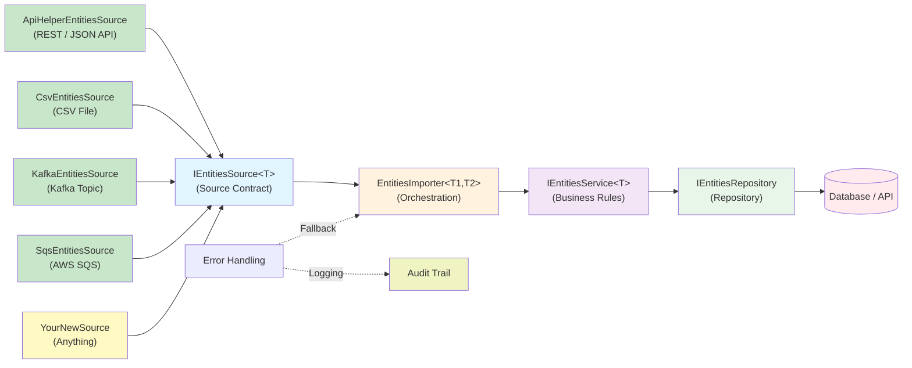
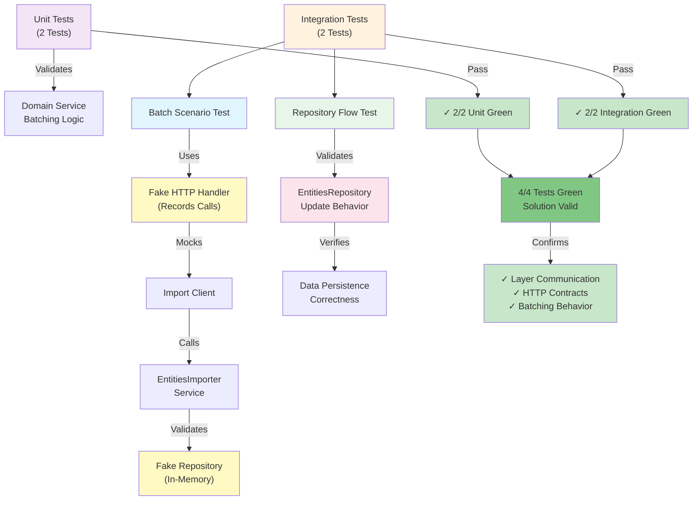

# ImportEntities

`ImportEntities` is a multi-project `.NET 8` import platform built to ingest entities from different source types (API, CSV, Kafka, SQS, etc.) through a single reusable pipeline.

It is designed as a clean, layered architecture with strong separation of concerns, generic business orchestration, and production-oriented observability.

---

## Why This Project Exists

Most import systems become tightly coupled to one source or one entity type. This project demonstrates a different approach:

- **Source-agnostic ingestion** through `IEntitiesSource<T>` adapters
- **Reusable orchestration** through `EntitiesImporter<TSource, TEntity>`
- **Composable business services** through `IEntitiesService<T>`
- **Pluggable persistence** through `IEntitiesRepository`

The result is a pipeline where adding a new source usually means adding one adapter class and registering it in a client.

---

## Architecture Overview



### Layer Responsibilities

- `Importer.Clients/*`: entry points, source adapters, and client-specific composition
- `Importer.Domain/*`: business rules, mapping, batching logic
- `Importer.Connect/*`: repository and external persistence boundary
- `Importer.Core/*`: shared primitives and utilities

### Solution Layout

- `Importer.Clients/ImporterMovies/`: console host for the movies import flow
- `Importer.Clients/ImporterMoviesClient/`: movies client composition and TMDB-specific integration
- `Importer.Clients/ImporterUsers/`: console host for the users import flow
- `Importer.Clients/ImporterUsersClient/`: users client composition and source integration
- `Importer.Clients/Importers.ImportClient/`: reusable source abstractions and importer orchestration
- `Importer.Clients/Importers.Models/`: shared transport and contract models
- `Importer.Domain/Importer.Business*/`: business services, mapping, and batching rules
- `Importer.Connect/Importer.DatabaseApi/`: repository and persistence boundary
- `Importer.Core/Core/`: cross-cutting primitives and shared helpers
- `ImportEntities.UnitTests/`: focused behavior tests for domain service logic
- `ImportEntities.IntegrationTests/`: end-to-end import and repository flow validation

---

## Project Scope

Current solution coverage includes:

- Movies importer client
- Users importer client
- Generic entity import orchestration
- Config-driven external API integration
- Structured logging with `ClientId` / `ClientName` context
- Azure Blob archive support for raw payload retention and replay
- Unit and integration tests via `xUnit`

---

## Evaluator Quick Path

If you are reviewing this project fresh, use this path:

1. Restore and build the solution:
    ```bash
    dotnet restore ImportEntities.sln
    dotnet build ImportEntities.sln -nologo
    ```
2. Configure any needed environment variables (`TMDB_API_KEY`, `INSTRUMENTATION_KEY`, `BLOB_STORAGE_CONNECTION_STRING`).
3. Run one importer client:
    ```bash
    dotnet run --project Importer.Clients/ImporterMovies/ImporterMoviesConsole.csproj
    ```
    or
    ```bash
    dotnet run --project Importer.Clients/ImporterUsers/ImporterUsersConsole.csproj
    ```
4. Run the test suite:
    ```bash
    dotnet test ImportEntities.sln -nologo --verbosity minimal
    ```

Expected result for the current baseline: all tests pass (`4/4`) and the importer pipeline executes through source adapter → business service → repository flow with structured logging and pluggable configuration.

---

## Quick Start

### 1) Prerequisites

- .NET SDK 8+
- Optional: TMDB API key (required only for Movies importer)
- Optional: Azure Application Insights key
- Optional: Azure Blob Storage connection string

### 2) Configure Settings

You can configure values through environment variables (recommended) or `appsettings.json`.

Environment variables:

```powershell
$env:TMDB_API_KEY="your-api-key-here"
$env:INSTRUMENTATION_KEY="your-app-insights-key"
$env:BLOB_STORAGE_CONNECTION_STRING="your-blob-storage-connection"
```

Config files:

- `Importer.Clients/ImporterMovies/appsettings.json`
- `Importer.Clients/ImporterUsers/appsettings.json`

### 3) Build and Run

```bash
dotnet restore ImportEntities.sln
dotnet build ImportEntities.sln
```

Run Movies importer:

```bash
dotnet run --project Importer.Clients/ImporterMovies/ImporterMoviesConsole.csproj
```

Run Users importer:

```bash
dotnet run --project Importer.Clients/ImporterUsers/ImporterUsersConsole.csproj
```

---

## Testing

Run unit tests:

```bash
dotnet test ImportEntities.UnitTests/ImportEntities.UnitTests.csproj -nologo --verbosity minimal
```

Run integration tests:

```bash
dotnet test ImportEntities.IntegrationTests/ImportEntities.IntegrationTests.csproj -nologo --verbosity minimal
```

Run all tests:

```bash
dotnet test ImportEntities.sln -nologo --verbosity minimal
```

### Integration Testing Strategy



Current status:

- Unit tests: `2/2` passing
- Integration tests: `2/2` passing
- Total: `4/4` passing

---

## Extending the Pipeline

### Add a New Source Adapter

Implement `IEntitiesSource<T>` in `Importers.ImportClient`:

```csharp
public class MyNewSource<T> : IEntitiesSource<T>
{
    public async Task<EntitySourceResult<T>> Read()
    {
        return new EntitySourceResult<T>
        {
            SourceId = "my-source",
            Entities = /* your List<T> */,
        };
    }
}
```

Register it in your client's `ConfigureSources()`:

```csharp
public override void ConfigureSources()
{
    base.ConfigureSources();

    AddSource(new ApiHelperEntitiesSource<MoviesWrapper, Movie>(
        _movieApiOptions.Endpoint, _apiHelperMovie));

    AddSource(new CsvEntitiesSource<Movie>(
        "data/extra-movies.csv",
        cols => new Movie { title = cols[0], overview = cols[1] }));
}
```

Available source stubs:

| Adapter | Location | Package |
|---|---|---|
| `ApiHelperEntitiesSource` | `Importers.ImportClient/Implementations/` | built-in |
| `CsvEntitiesSource` | `Importers.ImportClient/Sources/` | CsvHelper (optional) |
| `KafkaEntitiesSource` | `Importers.ImportClient/Sources/` | Confluent.Kafka |
| `SqsEntitiesSource` | `Importers.ImportClient/Sources/` | AWSSDK.SQS |

---

## Configuration and Security

Expected environment variables:

- `TMDB_API_KEY` (Movies importer)
- `INSTRUMENTATION_KEY` (Application Insights)
- `BLOB_STORAGE_CONNECTION_STRING` (blob archival)

Design principle: keys and endpoints are read from configuration and environment variables, not hard-coded in source.

---

## Engineering Practices Demonstrated

- SOLID-oriented layered architecture
- Dependency injection across clients, services, and repositories
- Generic service/repository orchestration
- Structured logging with Serilog
- Cloud observability integration (Application Insights + Blob archival)
- Test layering (unit + integration) with explicit behavior verification

---

## Reference Implementation Snippets

### Dependency Injection Setup

```csharp
private void InitializeClientDependencies()
{
    Initialize((context, services) =>
    {
        _serviceEntities =
            services
                .AddSingletonServices()
                .AddSingleton<IClientInfo, ClientInfo>()
                .AddSingleton<IClientService, ClientService>()
                .AddSingleton<IEntitiesService<Movie>, ClientMoviesService<Movie>>()
                .AddSingleton<IApiHelper<MoviesWrapper>, MoviesJsonApiHelper<MoviesWrapper>>()
                .BuildServiceProvider();
    }, "Movies.txt");
}
```

### GET from Source API (Config-Driven)

```csharp
protected override List<string> GetRawData(string endPoint)
{
    var rawDataList = new List<string>();

    if (string.IsNullOrWhiteSpace(_movieApiOptions.ApiKey))
        throw new InvalidOperationException(
            "Movies API key is missing. Configure ApiClients:Movies:ApiKey or TMDB_API_KEY.");

    var url = endPoint +
        $"?api_key={_movieApiOptions.ApiKey}&language={_movieApiOptions.Language}&page={_movieApiOptions.Page}";

    using (WebClient wc = new HttpClientUtils.WebClientWithTimeout())
    {
        wc.Proxy = null;
        var result = wc.DownloadString(url);
        rawDataList.Add(result);
    }

    return rawDataList;
}
```

### POST to Repository Endpoint

```csharp
public virtual async Task<string> UpdateEntities(string entities)
{
    var requestUri = new Uri(
        new Uri(_repositoryOptions.BaseUrl),
        _repositoryOptions.UpdateEntitiesPath);

    var content = new StringContent(entities, Encoding.UTF8, "application/json");
    var response = await _clientInfo.ClientHttp.PostAsync(requestUri, content);

    return await response.Content.ReadAsStringAsync();
}
```

### Blob Archival Example

```csharp
public async Task SaveBlobToAzureBlobStorage(string fileName, string blobContentType, string blobDetails)
{
    var blobStorageConnectionString = Environment.GetEnvironmentVariable("BLOB_STORAGE_CONNECTION_STRING");
    var storageAccount = CloudStorageAccount.Parse(blobStorageConnectionString);
    var blobClient = storageAccount.CreateCloudBlobClient();
    var container = blobClient.GetContainerReference("importer-archive");
    var blob = container.GetBlockBlobReference(fileName);
    blob.Properties.ContentType = blobContentType;
    await blob.UploadTextAsync(blobDetails).ConfigureAwait(false);
}
```

### Serilog Host Setup Example

```csharp
private IHost InitCommonDependencies(Action<HostBuilderContext, IServiceCollection> configureDependencyInjection)
{
    _hostBuilder = Host.CreateDefaultBuilder();
    var host = _hostBuilder
        .ConfigureServices(configureDependencyInjection)
        .UseSerilog()
        .Build();

    _host = host;
    return host;
}
```

---

## Contact

Questions, suggestions, or collaboration:

- Hamid Awad : hamid.naser1106@gmail.com
