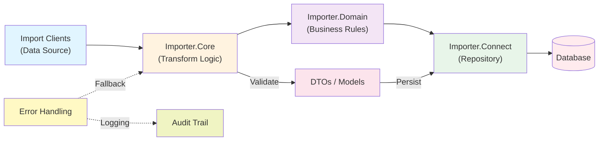
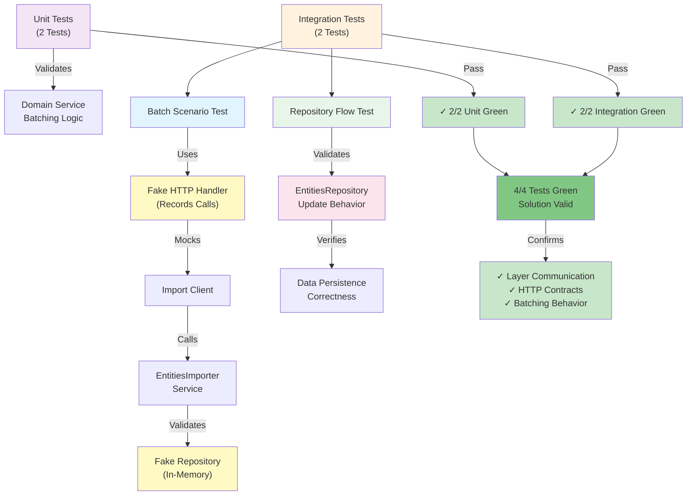
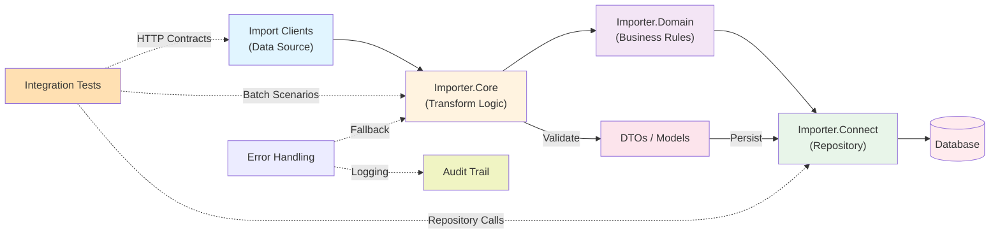

# Introduction

## Architecture Overview

### 1. Import Pipeline Architecture



### 2. Integration Testing Strategy



## Team Handoff Snapshot

`ImportEntities` is a multi-project `.NET 8` import pipeline organized into Core, Domain, Clients, and Connect layers.

### Current Scope

- Client entry points for Movies and Users imports.
- Generic importer orchestration (`EntitiesImporter<T1, T2>`) and business services.
- API ingestion, transformation, and repository update flow.
- Configuration-driven external integrations (API keys and endpoints).
- Unit tests (`xUnit`) for batching behavior in domain services.

### Architecture (High Level)



**Layer Details:**

- `Importer.Clients/*` contains entry points and client-specific composition.
- `Importer.Domain/*` contains business services and import rules.
- `Importer.Connect/*` contains repository/integration boundary.
- `Importer.Core/*` contains shared primitives and utility components.

### Secure Configuration

This project now expects keys/endpoints from configuration and environment variables.

- `TMDB_API_KEY` (movies API key override)
- `INSTRUMENTATION_KEY` (Application Insights)
- `BLOB_STORAGE_CONNECTION_STRING` (blob archive storage)

Endpoint and repository settings live in:

- `Importer.Clients/ImporterMovies/appsettings.json`
- `Importer.Clients/ImporterUsers/appsettings.json`

### Quick Start

#### Step 1: Obtain API Keys (If Running Movies Importer)

**TMDB API Key** (required for `ImporterMovies`):
1. Sign up at [https://www.themoviedb.org/settings/api](https://www.themoviedb.org/settings/api)
2. Create an API key via your account settings
3. Export as environment variable or paste in config

#### Step 2: Configure Endpoints and API Keys

**Option A: Environment Variables** (recommended for security)
```bash
set TMDB_API_KEY="your-api-key-here"
set INSTRUMENTATION_KEY="your-app-insights-key"
set BLOB_STORAGE_CONNECTION_STRING="your-blob-storage-connection"
```

**Option B: Edit appsettings.json**

`Importer.Clients/ImporterMovies/appsettings.json`:
```json
"ApiClients": {
  "Movies": {
    "Endpoint": "https://api.themoviedb.org/3/movie/popular",
    "ApiKey": "your-tmdb-api-key",
    "Language": "en-US",
    "Page": 1
  }
},
"Repository": {
  "BaseUrl": "https://jsonplaceholder.typicode.com",
  "UpdateEntitiesPath": "/posts"
}
```

`Importer.Clients/ImporterUsers/appsettings.json`:
- Mock data endpoint (no external API key required)

#### Step 3: Build and Run

**Build the solution:**
```bash
dotnet build ImportEntities.sln
```

**Run Movies Importer** (requires TMDB_API_KEY):
```bash
dotnet run --project Importer.Clients/ImporterMovies/ImporterMoviesConsole.csproj
```

**Run Users Importer** (no external API key needed):
```bash
dotnet run --project Importer.Clients/ImporterUsers/ImporterUsersConsole.csproj
```

### Step-by-Step: Run the Solution

1. Open a terminal in `ImportEntities` root.
2. Restore dependencies:
```bash
dotnet restore ImportEntities.sln
```
3. Build all projects:
```bash
dotnet build ImportEntities.sln
```
4. Configure environment variables (recommended for Movies importer):
```bash
set TMDB_API_KEY="your-api-key-here"
set INSTRUMENTATION_KEY="your-app-insights-key"
set BLOB_STORAGE_CONNECTION_STRING="your-blob-storage-connection"
```
5. Run Movies importer:
```bash
dotnet run --project Importer.Clients/ImporterMovies/ImporterMoviesConsole.csproj
```
6. Run Users importer:
```bash
dotnet run --project Importer.Clients/ImporterUsers/ImporterUsersConsole.csproj
```

### Step-by-Step: Run Unit Tests

1. Run all tests in the test project:
```bash
dotnet test ImportEntities.Tests/ImportEntities.Tests.csproj
```
2. (Optional) Run with detailed output:
```bash
dotnet test ImportEntities.Tests/ImportEntities.Tests.csproj --verbosity normal
```

### Step-by-Step: Run Integration Tests

1. Run integration tests in the dedicated project:
```bash
dotnet test ImportEntities.IntegrationTests/ImportEntities.IntegrationTests.csproj -nologo --verbosity minimal
```
2. (Optional) Run with detailed output for troubleshooting:
```bash
dotnet test ImportEntities.IntegrationTests/ImportEntities.IntegrationTests.csproj -nologo --verbosity detailed
```

### Quick Test Commands

```bash
# Unit-only
dotnet test ImportEntities.Tests/ImportEntities.Tests.csproj -nologo --verbosity minimal

# Integration-only
dotnet test ImportEntities.IntegrationTests/ImportEntities.IntegrationTests.csproj -nologo --verbosity minimal

# Full solution (all tests)
dotnet test ImportEntities.sln -nologo --verbosity minimal
```

### Integration Tests Status

- There is now a dedicated integration test project: `ImportEntities.IntegrationTests`.
- `Importer.Clients/Importers.Integration` remains an integration library/project (not a test project).
- Automated coverage now includes:
    - Unit tests in `ImportEntities.Tests` (xUnit)
    - Integration tests in `ImportEntities.IntegrationTests` (xUnit)

---

This project demonstrates the implementation of various software engineering principles and technologies, showcasing modern C# programming practices and the integration of Azure services.

## Purpose

The primary objective of this project is to provide a comprehensive example of scalable, maintainable, and testable code using best practices and clean architecture principles. It is designed for interview purposes to demonstrate proficiency in key software engineering concepts.

## Key Features

- **SOLID Design Principles**
  - Demonstrates the use of SOLID design patterns to ensure scalable and maintainable code.

- **Dependency Injection**
  - Utilizes dependency injection to manage class dependencies, promoting loose coupling and easier testing.
  - Example: [Dependency Injection Example](#dependency-injection-example)

- **Generics in Classes**
  - Implements generics (`<T>`) to create flexible and reusable class definitions.
  - Example: [Generics Example](#generics-example)  


- **API Integration**
  - **GET Requests**: Demonstrates how to call APIs and handle JSON responses.
  - **POST Requests**: Shows how to send data to APIs using POST requests.
  - Examples: [GET Request Example](#get-request-example), [POST Request Example](#post-request-example)  

- **Logging with Serilog**
  - Integrates Serilog for structured logging, making it easier to diagnose and monitor application behavior.
  - Example: [Serilog Logging Example](#serilog-logging-example)

- **Azure Services Integration**
  - **Application Insights**: Utilizes Azure Application Insights for monitoring and diagnostics.
  - **Blob Storage**: Demonstrates the use of Azure Blob Storage for storing and retrieving binary data.
  - Examples: [Application Insights Example](#application-insights-example), [Blob Storage Example](#blob-storage-example)


## Dependency Injection

## Dependency Injection Example

Dependency injection is utilized to manage class dependencies, promoting loose coupling and easier testing. The following code snippet demonstrates how to configure dependency injection for various services.

```csharp
private void InitializeClientDependencies()
{
    Initialize((context, services) =>
    {
        _serviceEntities =
            services
                .AddSingletonServices()

                .AddSingleton<IClientInfo, ClientInfo>()

                .AddSingleton<IClientService, ClientService>()
                
                .AddSingleton<IEntitiesService<Movie>, ClientMoviesService<Movie>>()

                .AddSingleton<IApiHelper<MoviesWrapper>, MoviesJsonApiHelper<MoviesWrapper>>()

                .BuildServiceProvider();
        
    }, "Movies.txt");
}
```

### Generics Example

Generics (`<T>`) are used to create flexible and reusable class definitions. The following example demonstrates the implementation of generics in a service class.

```csharp

public abstract class ApiHelper<T> : ApiHelperUtil<T>, IApiHelper<T> where T : new()
{
    protected IClientInfo _clientInfo;

    protected ApiHelper(IClientInfo clientInfo)
    {
        _clientInfo = clientInfo;
    }

    public async Task<Dictionary<string, T>> GetClientDataCollection(List<string> endpoints)
    {
        var clientDataDic = new Dictionary<string, T>();

        return await Task.FromResult(((Func<Dictionary<string, T>>) (() =>
        {
            try
            {
                endpoints.ForEach(endPoint =>
                {
                    clientDataDic.Add(endPoint, GetClientData(endPoint).GetAwaiter().GetResult());
                });
            }
            catch (Exception exception)
            { 
                Log.Logger.Error("{@LogMessage}", exception.GetaAllMessages());
            }

            return clientDataDic;
        }))());
    }

    public async Task<T> GetClientData(string endpoint)
    {
        return await Task.FromResult(((Func<T>) (() =>
        {
            try
            {
                var rawData = GetRawData(endpoint);
                if (rawData.HasAny())
                {
                    return GetData(rawData);
                }
            }
            catch (Exception exception)
            {
                Log.Logger.Error("{@LogMessage}", exception.GetaAllMessages());                
            }

            return default;
        }))());
    }

    protected abstract List<string> GetRawData(string endPoint);

    protected abstract T GetData(List<string> rawData);
}
```

## GET Request Example

```csharp
protected override List<string> GetRawData(string endPoint)
{
    var rawDataList = new List<string>();
    
    try
    {
        var apiKey = "fb65378988bd7263c04991e50189844f";
        var url = endPoint + $"?api_key={apiKey}&language=en-US&page=1";

        using (WebClient wc = new HttpClientUtils.WebClientWithTimeout())
        {
            wc.Proxy = null;
            var result = wc.DownloadString(url);  // GET request
            rawDataList.Add(result);
        }
    }
    catch (Exception e)
    {
        Log.Logger.Error("{@LogMessage}", e.GetaAllMessages());
        return rawDataList;
    }

    return rawDataList;
}
```

## POST Request Example

```csharp
public virtual async Task<string> UpdateEntities(string entities)
{
    var httpClient = new HttpClient();

    var requestString = $"/posts";

    var connectUri = "https://jsonplaceholder.typicode.com";

    var requestUri = new Uri(new Uri(connectUri), requestString);

    var content = new StringContent(entities, Encoding.UTF8, "application/json");

    var response = await httpClient.PostAsync(requestUri, content);

    if (!response.IsSuccessStatusCode)
    {
        var errorBuilder = new StringBuilder();
        errorBuilder.AppendLine("Connect entities batch update failed.");
        errorBuilder.AppendLine("Status Code " + response.StatusCode);
        var responseContent = await response.Content.ReadAsStringAsync();
        errorBuilder.AppendLine(responseContent);

    }

    return await response.Content.ReadAsStringAsync();
}
```

### Application Insights Example

Application Insights is used for monitoring and diagnosing application performance and reliability. It helps in tracking requests, dependencies, exceptions, and custom events.

#### Configuration

1. **Install the Application Insights SDK**:
    ```bash
    dotnet add package Microsoft.ApplicationInsights.AspNetCore
    ```

2. **Configure Application Insights in `appsettings.json`**:
    ```json
    {
      "ApplicationInsights": {
        "InstrumentationKey": "your_instrumentation_key"
      }
    }
    ```

3. **Initialize Application Insights in your code**:
    ```csharp
    protected virtual void InitializeLog(IConfigurationBuilder configurationBuilder, string logFileName)
    {
        var filepath = _configuration.GetSection("AppConfig").GetSection("FilePath").Value + logFileName;
        var jsonFormatter = new Serilog.Formatting.Json.JsonFormatter(renderMessage: true);
        var InstrumentationKey = Environment.GetEnvironmentVariable("INSTRUMENTATION_KEY") ?? string.Empty;

        Log.Logger = new LoggerConfiguration()
            .ReadFrom.Configuration(configurationBuilder.Build())
            .Enrich.FromLogContext()
            .WriteTo.ApplicationInsights(new TelemetryConfiguration { InstrumentationKey = InstrumentationKey }, TelemetryConverter.Traces)
            .WriteTo.Console()
            .CreateLogger()
            .ForContext("ClientId", _clientInfo.ClientId)
            .ForContext("ClientName", _clientInfo.ClientName);
    }
    ```

#### Example

```csharp
// Example code demonstrating how to log information using Serilog and Application Insights.
public void LogExample()
{
    Log.Information("This is a test log message for Application Insights.");
}
```

### Blob Storage Example

Azure Blob Storage is used to store and retrieve binary data such as files, images, and videos.

#### Saving Data to Blob Storage

```csharp
public async Task SaveBlobToAzureBlobStorage(string fileName, string blobContentType, string blobDetails)
{
    try
    {
        var blobStorageConnectionString = Environment.GetEnvironmentVariable("BLOB_STORAGE_CONNECTION_STRING");
        var storageAccount = CloudStorageAccount.Parse(blobStorageConnectionString);
        var blobClient = storageAccount.CreateCloudBlobClient();
        var container = blobClient.GetContainerReference("importer-archive");
        var blob = container.GetBlockBlobReference(fileName);
        blob.Properties.ContentType = blobContentType;
        await blob.UploadTextAsync(blobDetails).ConfigureAwait(false);
    }
    catch (Exception e)
    {
        Log.Logger.Error(e, e.ToString());
    }
}
```

#### Reading Data from Blob Storage

```csharp
public string ReadBlobFromAzureBlobStorage(string fileName)
{
    try
    {
        var blobStorageConnectionString = Environment.GetEnvironmentVariable("BLOB_STORAGE_CONNECTION_STRING");
        CloudStorageAccount storageAccount = CloudStorageAccount.Parse(blobStorageConnectionString);
        CloudBlobClient serviceClient = storageAccount.CreateCloudBlobClient();
        CloudBlobContainer container = serviceClient.GetContainerReference("importer-archive");
        CloudBlockBlob blob = container.GetBlockBlobReference(fileName);
        var blobContent = blob.DownloadTextAsync().Result;
        return blobContent;
    }
    catch (Exception e)
    {
        Log.Logger.Error(e, e.ToString());
    }
    return string.Empty;
}
```

#### Example

```csharp
// Example code demonstrating how to save and read data from Azure Blob Storage.
public async Task BlobStorageExample()
{
    string fileName = "example.txt";
    string contentType = "text/plain";
    string content = "This is an example content for blob storage.";

    // Save to blob
    await SaveBlobToAzureBlobStorage(fileName, contentType, content);

    // Read from blob
    string retrievedContent = ReadBlobFromAzureBlobStorage(fileName);
    Console.WriteLine(retrievedContent);
}
```

### Serilog Logging Example

The following code snippet demonstrates how to initialize common dependencies using Serilog for logging:

```csharp
private IHost InitCommonDependencies(Action<HostBuilderContext, IServiceCollection> configureDependencyInjection)
{
    try
    {
        _hostBuilder = Host.CreateDefaultBuilder();
        var host = _hostBuilder
            .ConfigureServices(configureDependencyInjection)
            .UseSerilog()
            .Build();

        _host = host;

        return host;
    }
    catch (Exception e)
    {
        Console.WriteLine(e);
        return null;
    }
}
```

#### Example

```csharp
// Example code demonstrating how to initialize common dependencies with Serilog.
public void InitializeDependenciesExample()
{
    var host = InitCommonDependencies((context, services) =>
    {
        // Configure additional services here.
    });

    if (host == null)
    {
        Console.WriteLine("Failed to initialize dependencies.");
    }
    else
    {
        Console.WriteLine("Dependencies initialized successfully.");
    }
}
```

## Additional Information

- This project serves as an example of modern C# programming practices.
- The code is structured to highlight best practices and clean architecture principles.

## Usage

- Clone the repository.
- Set up Azure services and configure the necessary environment variables.
- Review the example implementations and experiment with different features and integrations.

## Contact

For any questions or further information, please contact Hamid Awad at hamid.naser1106@gmail.com.

